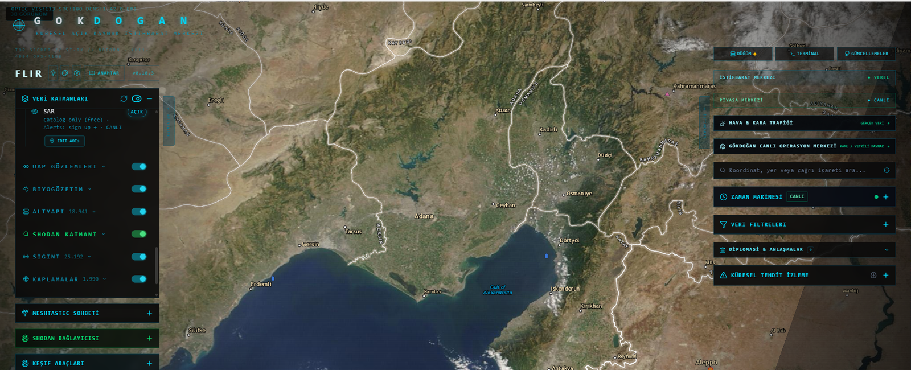
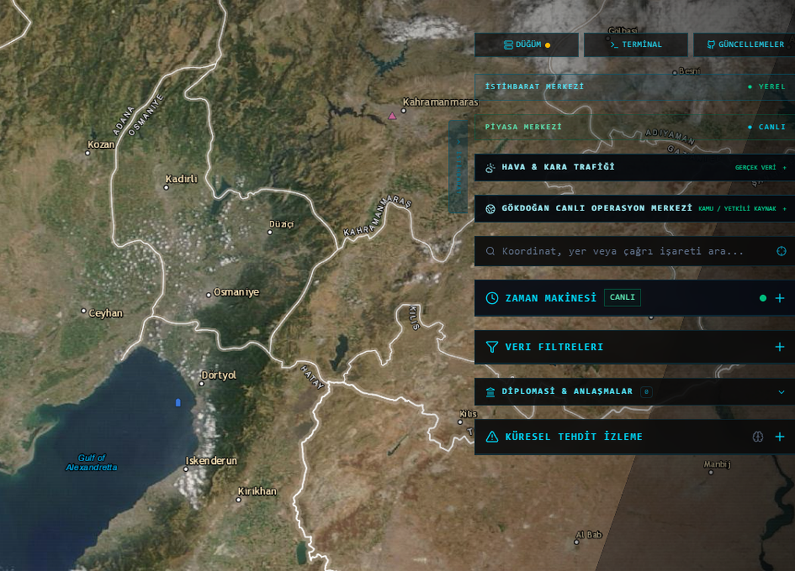
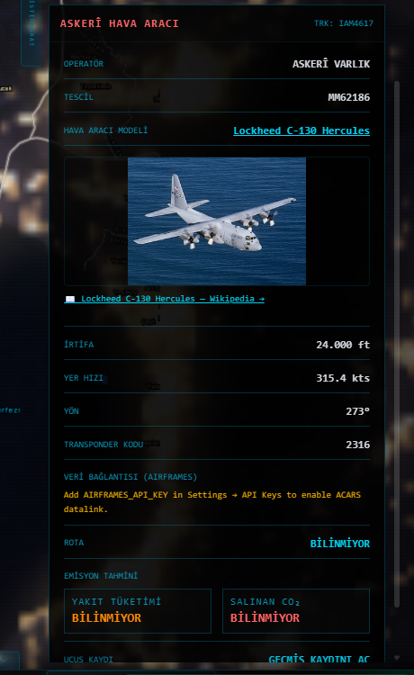
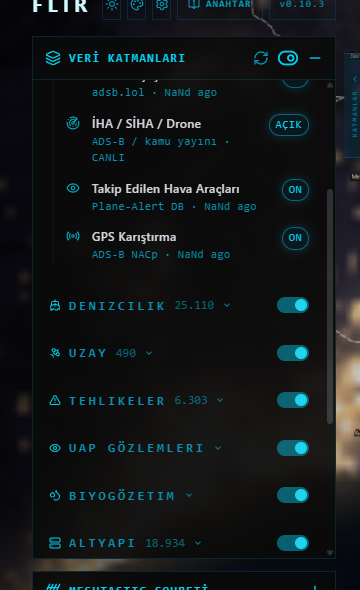
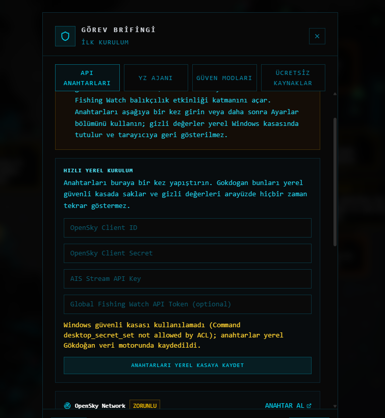

# Gökdoğan Intelligence

[Türkçe](README.md) | **English**

**Open-source, map-based OSINT and global situational-awareness desktop platform.**

Gökdoğan Intelligence brings public or properly authorized data sources into a single Windows desktop workspace. Its purpose is to reduce constant switching between websites, API dashboards and map services by presenting source health, map layers, events, observations and linked details in one interface.

**Release:** `v1.0.0` · **Technical core:** `R24 / 0.10.3` · **Platform:** Windows 10/11 x64 · **Desktop UI:** Turkish-first · **Repository/community support:** Turkish + English · **License:** AGPL-3.0

> [!IMPORTANT]
> Gökdoğan Intelligence is not an access-control bypass tool. Use it only with public data or sources you are authorized to access. Private/closed cameras, unauthorized systems, stolen credentials, person-targeted surveillance and operationally sensitive targeting are outside the intended scope of the public project.

## Project status

- Source code: public
- GitHub Sponsors: enabled
- CI and Windows release workflow: available
- First official release line: `v1.0.0`
- Global repository documentation: English support available
- Desktop localization: Turkish-first; broader UI localization should be implemented through localization-ready strings rather than hard-coded language forks

## Documentation

- [Turkish README](README.md)
- [English documentation index](docs/en/README.md)
- [Contributing — English](CONTRIBUTING.en.md)
- [Security Policy — English](SECURITY.en.md)
- [Community Support — English](SUPPORT.en.md)
- [Code of Conduct — English](CODE_OF_CONDUCT.en.md)
- [Branch protection / ruleset guide](docs/GITHUB-BRANCH-RULESET.md)
- [Data attribution](DATA-ATTRIBUTION.md)

Detailed Turkish documentation remains available under [`docs/`](docs/).

## Main capabilities

### Map and geospatial workspace

- MapLibre-based interactive map
- standard and satellite basemaps
- coordinate, place and callsign search
- layer toggles and filtering
- historical observations and time-oriented views
- source freshness and health indicators
- event, route and asset detail panels

### Aviation

- aircraft observations from public ADS-B sources
- civilian/commercial flights and other observations published by supported providers
- available telemetry such as callsign, registration/ICAO, altitude, speed and heading
- observed tracks and time series
- optional enrichment from providers such as OpenSky and Airframes

Military-related views are limited to public observations and public reference data. The project does not provide classified flight plans, closed telemetry or targeting data.

### Maritime

- AISStream and other configured public/authorized maritime sources
- MMSI/IMO and vessel metadata where available
- observed tracks, heading and speed
- live/cache/fallback behavior
- optional open-data enrichment such as Global Fishing Watch

### Public camera and traffic sources

- traffic/city camera catalogs published by public authorities
- official public camera lists added by the operator
- provider links opened in the system browser
- local API-key management for providers that require credentials

Gökdoğan **does not scan closed CCTV systems, crack passwords or bypass access controls**.

### Disasters, weather, news, traffic and markets

- earthquake, wildfire, volcano and global disaster alerts
- weather forecasts, radar, air quality and space weather
- Turkish and global news headlines
- traffic flow/incidents and border wait-time data where providers publish it
- currencies, precious metals, energy/commodities, crypto and index indicators

### Satellite and space

- satellite positions from CelesTrak TLE data
- NASA GIBS and configured imagery providers
- Copernicus/Sentinel-based optical or SAR workflows
- latest available imagery time and provider status

## Live-data states

| State | Meaning |
|---|---|
| `LIVE / CANLI` | Provider is returning current data. |
| `DELAYED / GECİKMELİ` | Data is available but delayed. |
| `CACHE / ÖNBELLEK` | Last successful data is being shown. |
| `KEY REQUIRED / ANAHTAR GEREKLİ` | A user API key is required for that integration. |
| `SOURCE DOWN / KAYNAK KAPALI` | Provider is unreachable or temporarily failing. |
| `LIMITED / SINIRLI` | Quota, regional coverage or licensing limits apply. |

## Installation

### End users

Download the published Windows `Setup.exe` and SHA-256 manifest from GitHub Releases. Verify the hash before running the installer.

### Building from source

1. Clone the repository into a clean directory, or extract the Source ZIP.
2. Run `START-HERE.bat` on Windows.
3. The builder validates dependencies and release gates.
4. Frontend, backend and Rust/Tauri tests are executed.
5. The NSIS installer is generated.
6. Installed-runtime self-tests are executed by the release flow where supported.
7. Successful builds generate Windows bundle/offline distribution artifacts under `dist`.

For the current detailed installation guide, see [`docs/KURULUM.md`](docs/KURULUM.md). An English documentation index is available at [`docs/en/README.md`](docs/en/README.md).

## API keys

1. Open **Settings → API Keys** in the application.
2. Enter credentials only for providers you choose to use.
3. Use **API SİSTEMİNİ TEST ET** to verify runtime integration status.
4. Review the source-health panel.

Never commit real API keys, tokens, passwords or private keys to this repository.

## Screenshots

### Regional operations map

### Global operations view

### Aircraft detail view

### Maritime, space and infrastructure layers

### API first-run setup

## Data sources and attribution

Example source families include adsb.lol, OpenSky Network, Airframes.io, AISStream, Global Fishing Watch, USGS, NASA FIRMS, NASA EONET, GDACS, Open-Meteo, RainViewer, NOAA, TomTom, TRT Haber, Anadolu Ajansı, GDELT, NASA GIBS, CelesTrak, Copernicus Data Space, OpenStreetMap, CARTO, Esri, OpenAQ and Wikidata.

Each provider has its own license, quota, geographic coverage and terms of use. See [`DATA-ATTRIBUTION.md`](DATA-ATTRIBUTION.md) and the reference documentation under [`docs/`](docs/).

## Security and responsible use

- Do not commit API keys or credentials.
- Do not bypass access controls on private systems.
- Follow provider licenses and privacy requirements for public camera sources.
- Do not use the project for sensitive person/location tracking or operational targeting.
- Do not disclose vulnerabilities through public Issues; follow [`SECURITY.en.md`](SECURITY.en.md).
- Read [`CONTRIBUTING.en.md`](CONTRIBUTING.en.md) before submitting changes.

## ❤️ Support the project

Gökdoğan Intelligence is developed as a free and open-source project.

The first community goal is **10 recurring monthly sponsors**. Support helps with Windows release infrastructure, testing, security maintenance, documentation, map performance and sustainable public/authorized data integrations.

See [`SUPPORT.en.md`](SUPPORT.en.md) for details.

> Sponsorship never grants access to private, classified, access-controlled or otherwise unavailable data sources.
