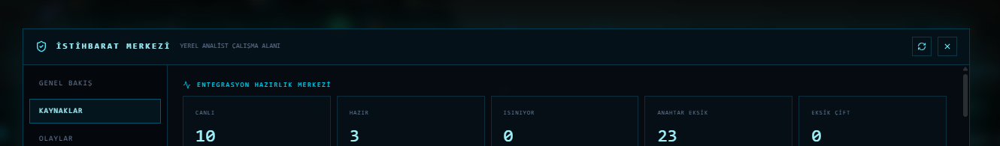
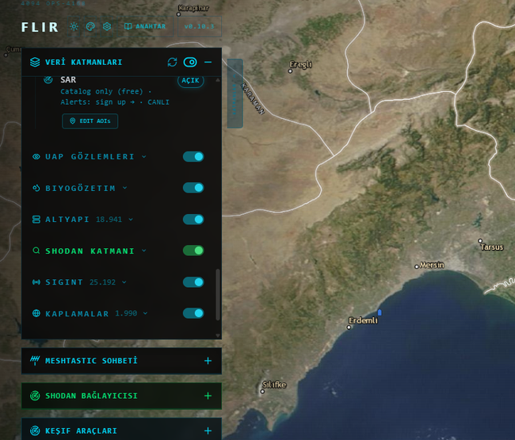
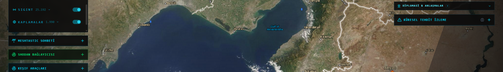
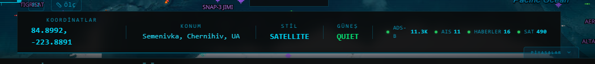
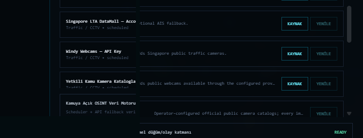

# Gökdoğan Intelligence

**Türkçe, harita tabanlı açık kaynak OSINT ve küresel durum farkındalığı, İstihbarat masaüstü platformu.**

Gökdoğan Intelligence; kamuya açık veya operatörün kullanım yetkisine sahip olduğu veri kaynaklarını tek bir Windows masaüstü çalışma alanında birleştirir. Amaç; farklı web sayfaları, API panelleri ve harita servisleri arasında sürekli geçiş yapmak yerine, kaynakların durumunu, harita katmanlarını, olayları ve bağlantılı ayrıntıları tek arayüzde izleyebilmektir.

**Sürüm:** `v1.0.0`  ·  **Teknik çekirdek:** `R24 / 0.10.3`  ·  **Platform:** Windows 10/11 x64  ·  **Varsayılan dil:** Türkçe  ·  **Lisans:** AGPL-3.0

> [!IMPORTANT]
> Gökdoğan Intelligence bir erişim kontrolü aşma aracı değildir. Yalnız kamuya açık veya kullanım yetkinizin bulunduğu kaynaklarla çalıştırılmalıdır. Özel/kapalı kameralar, yetkisiz sistemler, gizli kimlik bilgileri, kişi hedefli izleme veya hassas askerî hedefleme bu kamu sürümünün amacı değildir.

## İçindekiler

- [Kullanım amacı](#kullanım-amacı)
- [Başlıca yetenekler](#başlıca-yetenekler)
- [Canlı veri ne anlama gelir?](#canlı-veri-ne-anlama-gelir)
- [Uygulama görüntüleri](#uygulama-görüntüleri)
- [Kurulum](#kurulum)
- [İlk açılış ve API anahtarları](#ilk-açılış-ve-api-anahtarları)
- [Temel kullanım](#temel-kullanım)
- [Veri kaynakları ve referanslar](#veri-kaynakları-ve-referanslar)
- [Güvenlik, gizlilik ve yasal kullanım](#güvenlik-gizlilik-ve-yasal-kullanım)
- [Mimari](#mimari)
- [Sorun giderme](#sorun-giderme)
- [Projeyi destekleyin](#projeyi-destekleyin)

## Kullanım amacı

Gökdoğan Intelligence aşağıdaki çalışma senaryoları için tasarlanmıştır:

- kamuya açık kaynaklardan **durum farkındalığı, İstihbarat** oluşturmak,
- farklı veri sağlayıcılarını tek harita ve panel düzeninde karşılaştırmak,
- sivil/ticari hava ve deniz hareketlerini, olayları ve kaynak sağlığını izlemek,
- doğal afet, meteoroloji, trafik, haber, diplomasi ve piyasa sinyallerini aynı çalışma alanında görmek,
- araştırma, açık kaynak analiz, kriz/afet takibi ve akademik/teknik inceleme süreçlerini hızlandırmak,
- hangi kaynağın canlı, gecikmeli, önbellekten, çevrimdışı veya API anahtarı bekleyen durumda olduğunu ayırt etmek.

Gökdoğan bir **resmî hava trafik kontrol sistemi, deniz trafik yönetim sistemi, acil durum komuta sistemi veya güvenlik/askerî karar destek sistemi değildir**. Üçüncü taraf verileri eksik, gecikmeli veya hatalı olabilir.

## Başlıca yetenekler

### Harita ve coğrafi çalışma alanı

- MapLibre tabanlı etkileşimli harita
- standart ve uydu altlıkları
- koordinat / yer / çağrı işareti araması
- katman açma-kapama ve filtreleme
- zaman makinesi ve geçmiş gözlem kayıtları
- kaynak tazelik/sağlık göstergeleri
- olay, rota ve varlık ayrıntı panelleri

### Havacılık

- kamu ADS-B kaynaklarından hava aracı gözlemleri
- sivil/ticari uçuşlar ve sağlayıcının yayımladığı diğer kamu gözlemleri
- çağrı işareti, tescil/ICAO bilgileri, irtifa, hız, yön gibi mevcut telemetri
- gözlenen rota izi ve zaman serisi
- yapılandırılmışsa OpenSky/Airframes gibi sağlayıcılardan ek zenginleştirme
- kamu verisinde bulunan askerî hava aracı sınıflandırmalarını ayrı gösterebilme

> Askerî görünüm, yalnız kamuya açık gözlem/referans verisini sunmak içindir; gizli uçuş planı, kapalı telemetri veya hedefleme verisi sağlamaz.

### Denizcilik

- AISStream ve diğer yapılandırılmış kamu/yetkili deniz kaynakları
- MMSI/IMO ve gemi meta verisi mevcut olduğunda ayrıntı görünümü
- gözlenen rota/iz, yön ve hız
- sağlayıcı kullanılabilirliğine göre canlı/önbellek/fallback davranışı
- Global Fishing Watch gibi isteğe bağlı açık veri zenginleştirmeleri

### Kamu kamera ve trafik görüntü kaynakları

- kamu kurumlarının yayımladığı trafik/kent kamera katalogları
- operatörün yetkili şekilde eklediği resmi kamu kamera listeleri
- sağlayıcı bağlantısını sistem tarayıcısında açma
- API anahtarı gerektiren kamera sağlayıcıları için yerel anahtar yönetimi

Gökdoğan **kapalı CCTV sistemlerini taramaz, parola kırmaz ve erişim kontrolü aşmaz**. GitHub dokümantasyonunda üçüncü taraf canlı kamera kareleri yeniden yayımlanmaz; lisans ve mahremiyet sorumluluğu sağlayıcı bağlantısı üzerinden korunur.

### Afetler ve çevresel olaylar

- deprem
- yangın / termal anomali
- yanardağ
- küresel afet uyarıları
- şiddetli hava olayları
- hava kalitesi ve çevresel katmanlar

### Meteoroloji

- hava tahmini
- sıcaklık ve hava olayları
- radar katmanları
- hava kalitesi
- deniz/hava koşulları
- uzay havası göstergeleri

### Haber, diplomasi ve olay akışları

- Türkiye ve küresel haber başlıkları
- kaynak bağlantıları
- GDELT gibi olay akışları
- açık kaynak diplomasi/anlaşma sinyalleri
- olayların harita ve zaman bağlamıyla birlikte incelenmesi

### Trafik, sınırlar ve altyapı

- yapılandırılmış trafik akışı/olay verileri
- sağlayıcı yayımlıyorsa sınır bekleme süreleri
- kamuya açık stratejik altyapı/reference katmanları
- enerji ve altyapı veri setleri

Kamuya açık askerî üs/stratejik referans katmanları bulunabilir; **gizli, kapalı veya yayımlanmamış konumların keşfi hedeflenmez**.

### Uydu ve uzay

- CelesTrak TLE verileriyle uydu konumları
- NASA GIBS ve yapılandırılmış görüntü sağlayıcıları
- Copernicus/Sentinel tabanlı optik veya SAR görüntü iş akışları
- son mevcut görüntü zamanı ve sağlayıcı durumu

### Piyasalar

- döviz
- değerli metaller
- enerji/emtia
- kripto varlıklar
- borsa/endeks göstergeleri

## Canlı veri ne anlama gelir?

Gökdoğan'da **CANLI** ifadesi, sağlayıcının sunduğu en güncel akışın kullanılabildiğini gösterir; sıfır gecikme garantisi anlamına gelmez.

| Durum | Anlamı |
|---|---|
| `CANLI` | Sağlayıcı güncel veri veriyor. |
| `GECİKMELİ` | Kaynak veri yayımlıyor ancak zaman farkı var. |
| `ÖNBELLEK` | Son başarılı veri gösteriliyor. |
| `ANAHTAR GEREKLİ` | İlgili özellik için kullanıcı API anahtarı gerekiyor. |
| `KAYNAK KAPALI` | Sağlayıcı erişilemiyor veya geçici hata veriyor. |
| `SINIRLI` | Kota, bölgesel kapsama veya lisans sınırlaması var. |

AIS, ADS-B, haber, kamera, uydu görüntüsü ve piyasa kaynaklarının güncellik aralığı birbirinden farklıdır.

## Uygulama görüntüleri

### 1. Bölgesel operasyon haritası

### 2. Küresel operasyon görünümü

### 3. Askerî hava aracı ayrıntı görünümü

### 4. Denizcilik, uzay ve altyapı katmanları

### 5. API ilk kurulum

### 6. Entegrasyon hazırlık özeti

### 7. Veri katmanları paneli

### 8. Yardımcı araçlar ve analiz panelleri

### 9. Canlı veri durum çubuğu

### 10. Kamu kamera / CCTV kaynak kayıtları

Daha ayrıntılı görsel açıklamaları: [`docs/EKRAN-GORUNTULERI.md`](docs/EKRAN-GORUNTULERI.md)

## Kurulum

### Son kullanıcı kurulumu

GitHub Releases bölümünden yayımlanan Windows `Setup.exe` dosyasını ve SHA-256 manifestini indirin. Hash doğrulamasından sonra installer'ı çalıştırın.

> v1.0.0 build zinciri code-signing sertifikası verilmeden derlenirse Windows installer `NotSigned` görünebilir. Bu durumda dosyanın yalnız resmi GitHub Release varlığından geldiğini ve SHA-256 değerinin eşleştiğini doğrulayın.

### Kaynaktan tek tık derleme

1. Depoyu veya Source ZIP'i **yeni ve boş bir klasöre** çıkarın.
2. `START-HERE.bat` dosyasını çalıştırın.
3. Builder Windows/WebView2, Node, Rust, Python, kilit dosyaları ve release kapılarını doğrular.
4. Frontend, backend ve Tauri/Rust testleri çalışır.
5. NSIS installer oluşturulur.
6. Installer kurulup kurulu runtime öz testi yapılır.
7. Başarılı build sonunda `dist` klasöründe Windows bundle ve Offline USB paketi oluşturulur.

Ayrıntılı kurulum: [`docs/KURULUM.md`](docs/KURULUM.md)

## İlk açılış ve API anahtarları

Gökdoğan'ın temel kamu kaynaklarının bir kısmı anahtarsız çalışabilir; bazı zenginleştirmeler ise sağlayıcı hesabı ister.

1. **Ayarlar → API Anahtarları** bölümünü açın.
2. Kullanacağınız sağlayıcıların anahtarlarını girin.
3. **API SİSTEMİNİ TEST ET** ile kayıt/runtime durumunu doğrulayın.
4. Kaynak Sağlığı veya İstihbarat Merkezi üzerinden durumları kontrol edin.
5. Anahtar gerektirmeyen kaynakların `ANAHTAR EKSİK` olarak değerlendirilmediğinden emin olun.

Anahtarlar kaynak koduna yazılmamalı ve GitHub'a gönderilmemelidir.

Ayrıntılı API rehberi: [`docs/VERI-KAYNAKLARI-VE-API.md`](docs/VERI-KAYNAKLARI-VE-API.md)

## Temel kullanım

- **Sol panel:** veri katmanlarını açar/kapatır ve mevcut katman sayaçlarını gösterir.
- **Harita:** işaretlere tıklayarak detay paneli açın; zoom ve altlık seçeneklerini kullanın.
- **Sağ panel:** canlı operasyon merkezi, piyasa, hava/kara trafiği, diplomasi, filtreler ve diğer modüller.
- **Arama:** koordinat, yer veya desteklenen çağrı işaretiyle konuma gidin.
- **Zaman Makinesi:** geçmiş gözlem/snapshot kayıtlarını inceleyin.
- **API Ayarları:** sağlayıcı anahtarlarını yerel olarak yönetin.
- **Kaynak Sağlığı:** canlı, gecikmeli, önbellek veya çevrimdışı sağlayıcıları ayırt edin.
- **Harici bağlantılar:** kaynak makalesi, sağlayıcı sayfası veya kamu kamera bağlantısını Windows varsayılan tarayıcısında açın.

Tam kullanım kılavuzu: [`docs/KULLANIM-KILAVUZU.md`](docs/KULLANIM-KILAVUZU.md)

## Veri kaynakları ve referanslar

Gökdoğan tek bir sağlayıcıya bağlı değildir. Örnek kaynak aileleri:

| Alan | Örnek kaynaklar |
|---|---|
| Hava araçları | [adsb.lol](https://adsb.lol), [OpenSky Network](https://opensky-network.org), [Airframes.io](https://airframes.io) |
| Deniz araçları | [AISStream](https://aisstream.io), [Global Fishing Watch](https://globalfishingwatch.org) |
| Afetler | [USGS](https://earthquake.usgs.gov), [NASA FIRMS](https://firms.modaps.eosdis.nasa.gov), [NASA EONET](https://eonet.gsfc.nasa.gov), [GDACS](https://www.gdacs.org), [Smithsonian GVP](https://volcano.si.edu) |
| Hava / radar | [Open-Meteo](https://open-meteo.com), [RainViewer](https://www.rainviewer.com), [NOAA NWS](https://www.weather.gov) |
| Trafik | [TomTom Traffic](https://developer.tomtom.com) |
| Haber / olay | [TRT Haber](https://www.trthaber.com), [Anadolu Ajansı](https://www.aa.com.tr), [GDELT](https://www.gdeltproject.org) |
| Uydu / uzay | [NASA GIBS](https://www.earthdata.nasa.gov/eosdis/science-system-description/eosdis-components/gibs), [CelesTrak](https://celestrak.org), [Copernicus Data Space](https://dataspace.copernicus.eu) |
| Harita | [OpenStreetMap](https://www.openstreetmap.org), [CARTO](https://carto.com), [Esri](https://www.esri.com) |
| Hava kalitesi | [OpenAQ](https://openaq.org) |
| Bilgi grafı | [Wikidata](https://www.wikidata.org) |

Her veri sağlayıcının kendi kullanım koşulları, lisansı, kotası ve bölgesel kapsamı geçerlidir. Ayrıntılı liste: [`DATA-ATTRIBUTION.md`](DATA-ATTRIBUTION.md) ve [`docs/REFERANSLAR.md`](docs/REFERANSLAR.md).

## Güvenlik, gizlilik ve yasal kullanım

- API anahtarlarını commit etmeyin.
- Özel/kapalı sistemlerin erişim kontrolünü aşmayın.
- Kamu kamera kaynaklarını sağlayıcı lisans ve mahremiyet koşullarına göre kullanın.
- Hassas kişi/konum takibi veya operasyonel hedefleme amacıyla kullanmayın.
- Haritadaki verileri kritik kararlar için tek kaynak kabul etmeyin.
- Finans/piyasa verileri yatırım tavsiyesi değildir.

Ayrıntılar: [`SECURITY.md`](SECURITY.md), [`PRIVACY.md`](PRIVACY.md), [`RESPONSIBLE-USE.md`](RESPONSIBLE-USE.md), [`docs/YASAL-UYARI-VE-SORUMLU-KULLANIM.md`](docs/YASAL-UYARI-VE-SORUMLU-KULLANIM.md).

## Mimari

Gökdoğan Intelligence üç ana çalışma katmanından oluşur:

- **Frontend:** Next.js / TypeScript / MapLibre
- **Backend:** FastAPI / Python
- **Masaüstü kabuğu:** Tauri / Rust / WebView2

Windows paketlemesi NSIS üzerinden yapılır. Python runtime uygulamayla birlikte self-contained biçimde paketlenir.

## Sorun giderme

Öncelikle uygulama içindeki **Kaynak Sağlığı**, **İstihbarat Merkezi** ve **API SİSTEMİNİ TEST ET** araçlarını kullanın. Build sorunlarında `windows-desktop-build.log`, runtime sorunlarında uygulamanın yerel logları incelenmelidir.

Ayrıntılı sorun giderme: [`docs/SORUN-GIDERME.md`](docs/SORUN-GIDERME.md)

## Projeyi destekleyin

Gökdoğan Intelligence ücretsiz ve açık kaynak olarak geliştirilmektedir. Projeyi faydalı buluyorsanız geliştirme, test altyapısı, Windows dağıtımları, dokümantasyon, performans iyileştirmeleri, güvenlik güncellemeleri ve kamuya açık veri kaynağı entegrasyonlarının sürdürülmesine destek olabilirsiniz.

[❤️ **GitHub Sponsors ile Gökdoğan Intelligence'ı destekleyin**](https://github.com/sponsors/RadiatonTR)

Sponsor destekleri özellikle şu alanlara katkı sağlar:

- Windows build, release ve code-signing giderleri
- test ve kalite güvence altyapısı
- harita ve performans geliştirmeleri
- kamuya açık/yetkili veri kaynağı entegrasyonları
- güvenlik ve bağımlılık güncellemeleri
- dokümantasyon ve sürdürülebilir bakım

> [!NOTE]
> Sponsorluk herhangi bir özel, gizli, erişim kontrollü veya normalde erişilemeyen veri kaynağına erişim hakkı sağlamaz. Gökdoğan Intelligence'ın kamu sürümü yalnız kamuya açık veya kullanım yetkinizin bulunduğu kaynaklarla çalıştırılmalıdır.
